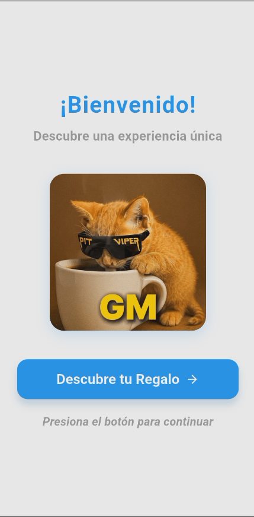
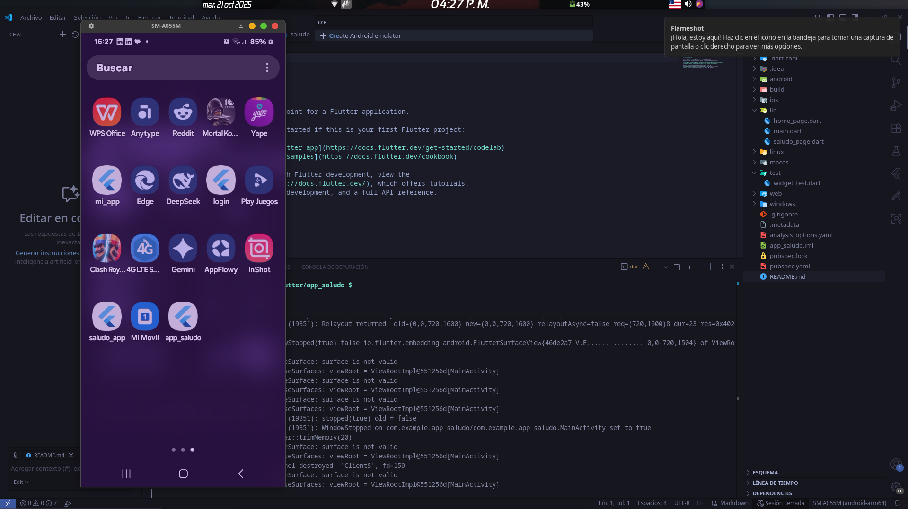
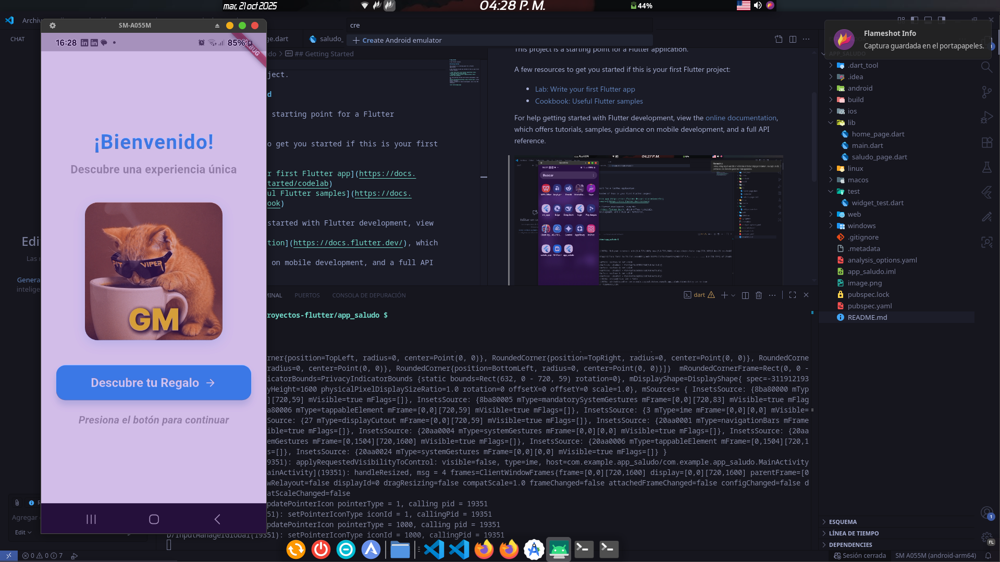
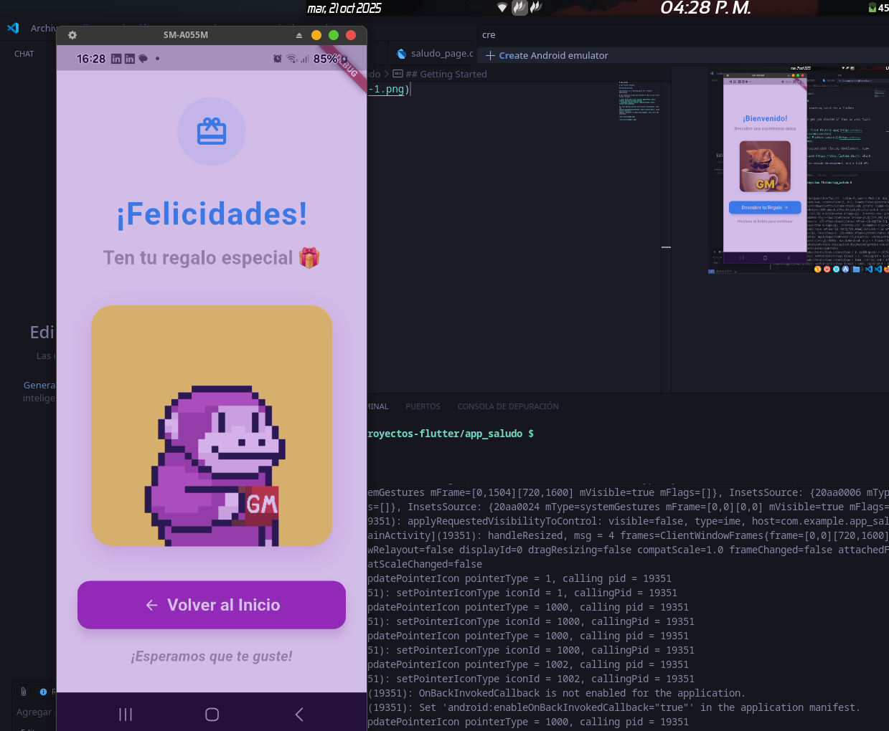

#  App de Saludo Interactiva - Documentación
# ESTUDIANTE: Brayan Quispe Mamani

## Descripción de la App
 , 
Una aplicación Flutter moderna y atractiva que ofrece una experiencia de bienvenida interactiva con animaciones GIF. La app guía al usuario a través de una pantalla de inicio con un mensaje de bienvenida y lo lleva a una pantalla de regalo sorpresa con animaciones divertidas.

### ✨ Características Principales
- **Diseño moderno** con bordes redondeados y sombras
- **Animaciones GIF** integradas de forma nativa
- **Navegación fluida** con transiciones animadas
- **Interfaz intuitiva** y user-friendly
- **Loading states** para mejor experiencia de usuario




## 🚀 Cómo Funciona la App

### Flujo de la Aplicación
1. **Pantalla de Inicio (HomePage)**: Muestra un mensaje de bienvenida con GIF animado
2. **Navegación**: Botón que lleva a la pantalla de regalo con transición animada
3. **Pantalla de Regalo (SaludoPage)**: Muestra un regalo sorpresa con GIF animado
4. **Regreso**: Botón para volver a la pantalla inicial

### Arquitectura
```
main.dart → HomePage → SaludoPage
```

##  Explicación del Funcionamiento

### 1. **Estructura de Navegación**
```dart
// Navegación con animación personalizada
Navigator.push(
  context,
  PageRouteBuilder(
    pageBuilder: (context, animation, secondaryAnimation) => const SaludoPage(),
    transitionsBuilder: (context, animation, secondaryAnimation, child) {
      const begin = Offset(1.0, 0.0);  // Comienza desde la derecha
      const end = Offset.zero;          // Termina en posición normal
      var tween = Tween(begin: begin, end: end);
      var offsetAnimation = animation.drive(tween);
      
      return SlideTransition(
        position: offsetAnimation,
        child: child,
      );
    },
  ),
);
```

### 2. **Manejo de Estados de Carga**
```dart
loadingBuilder: (context, child, loadingProgress) {
  if (loadingProgress == null) return child; // GIF cargado
  return Center(
    child: CircularProgressIndicator(), // Muestra loader mientras carga
  );
},
```

### 3. **Diseño Responsivo**
- Uso de `SafeArea` para evitar overlaps
- `Padding` consistente en todas las pantallas
- `SizedBox` para espaciado controlado
- `MainAxisAlignment.center` para centrado vertical

### 4. **Personalización de Componentes**
```dart
// Botones personalizados
ElevatedButton.styleFrom(
  backgroundColor: Colors.blue,
  foregroundColor: Colors.white,
  elevation: 8,
  shape: RoundedRectangleBorder(
    borderRadius: BorderRadius.circular(15),
  ),
)
```

## Características Técnicas

- **Framework**: Flutter 3.0+
- **Lenguaje**: Dart
- **Animaciones**: GIF nativos + transiciones personalizadas
- **Responsive**: Diseño adaptable a diferentes tamaños de pantalla
- **Performance**: Loading states para mejor experiencia

## 📦 Dependencias

No se requieren dependencias externas - utiliza solo los paquetes nativos de Flutter:
- `material.dart` para componentes UI
- Widgets nativos para imágenes y navegación

¡Tu app está lista para usar! 🚀 Los GIFs se cargan dinámicamente y la interfaz es moderna y atractiva.

- [Lab: Write your first Flutter app](https://docs.flutter.dev/get-started/codelab)
- [Cookbook: Useful Flutter samples](https://docs.flutter.dev/cookbook)

For help getting started with Flutter development, view the
[online documentation](https://docs.flutter.dev/), which offers tutorials,
samples, guidance on mobile development, and a full API reference.

scrcpy
